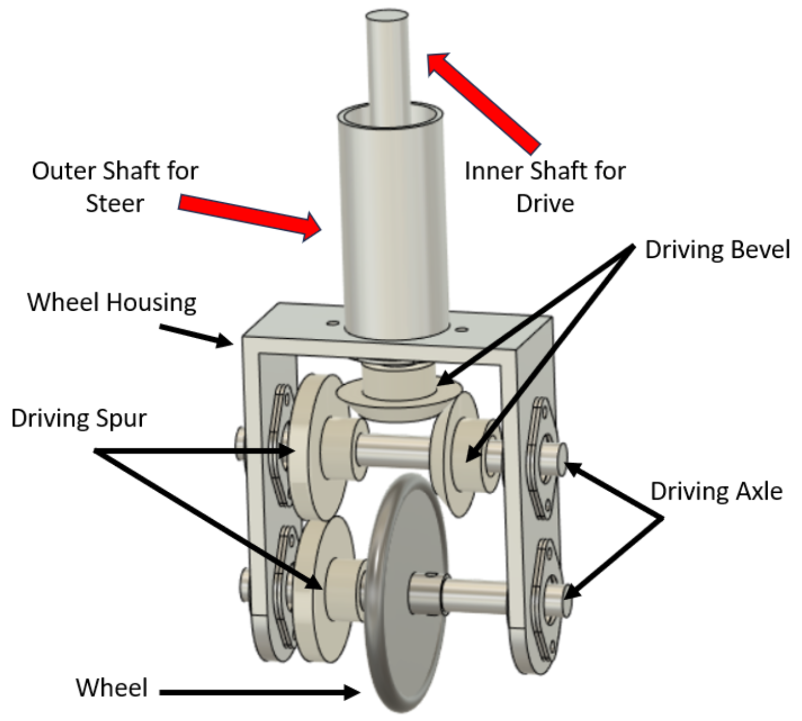
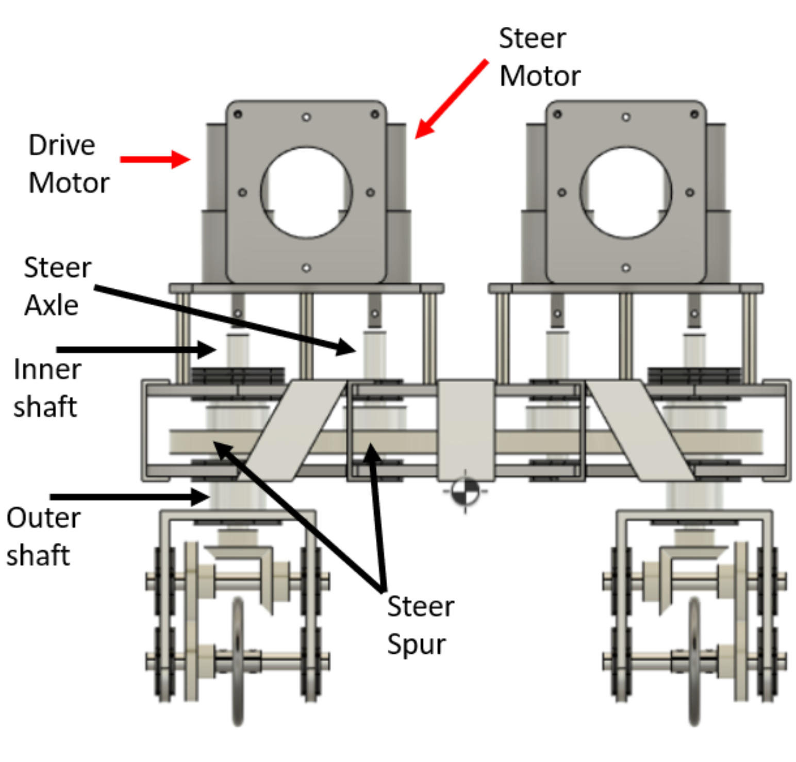
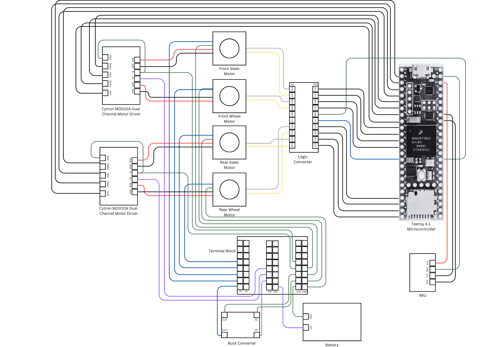

# BiSteerCycle

## Background
People have ridden two-wheeled vehicles since at least the early 1800's, when Karl von Drais created the predecessor to modern-day bicycles. Since then, a variety of two-wheeled single-track and dicycle vehicles have been developed, including the modern bicycle, scooters, motorcycles, and the Segway. Despite the diversity in application and design of these vehicles, however, these vehicles all share a common feature: the steering angles for at least one of the two wheels on each vehicle are fixed. The effect of this design feature is that the movement of two-wheeled vehicles is subject to a non-holonomic constraint, and consequently these vehicles are incapable of translating in directions orthogonal to the directions in which their wheels with fixed steering angles point.

To overcome this limitation in two-wheeled vehicle design, the aim of this project was to design and to create a two-wheeled autonomous robot, hereafter referred to as the “Bi-Steer Cycle”, which has power applied independently to each wheel and which also possesses continuous rotation about each wheel’s steering axle. Creating such a machine not only produces utility from a pedagogical viewpoint, but also may lend to the development of new forms of transportation in the future.

**Credits:** Chris Li, Final Report 2021.

## Motor Controller Design and Derivation

Here are some papers that can be reffered to for the derivation of the motor controllers:
- Dynamic model derivation and controller design for an autonomous bicycle, Shihao Wang, 2014: http://ruina.org/Courses/AutonomousBicycleTeam/ShihaoWang.pdf
- Small Wheel Bicycle Model Derivation, Zhidi Yang, 2018: http://ruina.org/Courses/AutonomousBicycleTeam/Zhidi%20Yang%20-%20Small_Wheel_Bicycle_Model_Derivation_and_Balancing_Controller_Design%20-%208.3[12156].pdf
- Nonlinear Control of a Double-Steering Robotic Bicycle: From Bicycle to Segway and In-Between, Anshuman Das, 2019: https://drive.google.com/file/d/12ZRajRatO-e00aLpMvUlQFlpHTXgZLRS/view

## Hardware Components

- Teensy 4.1 Microcontroller
- Rhino 100RPM 25Kgcm 12V DC Planetary Geared Quad Encoder Servo Motor (RMCS-5031)
- Rhino 500RPM 6KGCM 12V DC Planetary Geared Quad Encoder Servo Motor (RMCS-5034)
- Cytron MDD10A Motor Driver
- BNO-055 Inertial Measurement Unit
- LM2596S DC Buck Converter
- Songle Single-channel 5V 30A Relay Module

## Assembly

Fig: Front Wheel Assembly

Fig: BiSteer Assembly

**Credits:** Nilay Srivastava, BiSteer Cycle 2023

## Pin Diagram

**Credits:** Jia Bhargava, Tanay Srinivasa

## Folder Structure

### Arduino Code
This folder contains all code used on the hardware, both for testing individual components, and the BiSteer Hardware.

- **bi_steer_cycle_testing**: Used to test deadband of BiSteer 
Motors, Motor Calibration, Filters for MPU and BNO-055.
- **main_bisteer**: Used for Controller Tuning of Steer Motors, Segway  Configuration, BiCycle Configuration and Track Stand Configuration.
- **filter_test**: Used to compare Kalman Filter, Complimentary Filter and Sensor Fusion Algorithm for IMU Readings.
- **segway_complimentary**: Code for Segway using a Single Servo Motor with Quad Encoder and MPU6050 with a complimentary filter.

### MATLAB
This folder contains the MATLAB Simulations used for the bisteer cycle, both using a force model and an acceleration model.

### Python
This folder contains the measurement code, visualisation code, and measured data from three experiments: Deadband Test of Motors, Filter Testing, Motor Calibration.

#### deadband tests
##### deadband 8bit
This experiment found the PWM input corresponding to the exit of the deadband of the motors with a PWM Resolution set to 8 bits.
- plot_from_serial.py: Contains code to read data from Serial Channel and plot commanded input vs measured position, commanded input vs measured speed for a ramp and triangle input.
- deadband_plotting.py: Contains code to plot compensated and uncompensated data for the front and rear wheel motors for a triangle input.
- plots: Contains Plotted Images from plot_from_serial and deadband_plotting.
- SourceData: Contains Measured Data from Serial Channel.

##### deadband 12bit
This experiment found the PWM input corresponding to the exit of the deadband of the motors with a PWM Resolution set to 12 bits.

- rear_from_serial.py: Contains code to read data from Serial Channel and store in a CSV File in SourceData.
- deadband_plotting.py: Contains code to plot compensated and uncompensated data for the front and rear wheel motors for a triangle input.
- plots: Contains Plotted Images from deadband_plotting.py.
- SourceData: Contains Measured Data from Serial Channel.

##### deadband entry
This experiment found the PWM input corresponding to the entry into the deadband of the motors with a PWM Resolution set to 12 bits.

- read_from_serial.py: Contains code to read data from Serial Channel and store in a CSV File in SourceData.
- deadband_entry.py: Contains code to plot the input and response vs time plots for the front and rear motor for a triangle wave with slope 10, 20 and 40.
- entry_graph.py: Contains code to plot the deadband entry point vs the slope of the triangle wave.
- friction_coeff.py: Contains code to plot the deadband entry and exit points on the input, response vs time graphs and input vs response graphs.
- plotting_constants.csv: Contains all constants used for plots in friction_coeff.py
- plots: Contains Plotted Images from entry_graph.py, deadband_entry.py, friction_coeff.py.
- SourceData: Contains Measured Data from Serial Channel.

##### deadband coeff
This experiment found the trend of PWM inputs corresponding to the entry and exit for various slopes of triangle waves. The PWM Resolution is set to 12 bits.
- read_from_serial.py: Contains code to read data from Serial Channel.
- plotting code:
    - find_constants_10.py: Code to find and store time of deadband starts, ends and corresponding PWM Input for 10 Time Periods.
    - plotting_coeffs.py: Contains code to plot the deadband entry and exit points on the input, response vs time graphs and input vs response graphs for 2 Time Period Uncompensated Measurements.
    - plotting_compensation.py: Contains code to plot the deadband entry and exit points on the input, response vs time graphs and input vs response graphs for 2 Time Period Compensated Measurements.
    - plot_entry_trend.py: Contains code to plot trend of deadband entry points with respect to slopes of input Triangle Waves.
    - plot_exit_trend.py: Contains code to plot trend of deadband entry points with respect to slopes of input Triangle Waves.
- plots: Contains Plotted Images from plotting code.
- plot constants: Contains Saved Constants for plotting code.
- SourceData: Contains Measured Data from Serial Channel for 2 Time Periods.
- SourceData10: Contains Measured Data from Serial Channel for 10 Time Periods.

#### filter test
##### filter testing 90
This experiment measures the settling time and maximum overshoot of the Bosch Sensor Fusion Algorithm and Kalman Filter for a BNO-055 IMU which is rotated 90 degrees.

- plot_bno_data.py: Contains code to read data from a serial channel and plot the measured angles with respect to time.
- plots: Contains Plotted Images from plotting code.
- SensorData: Contains Measured Data from Serial Channels.

##### filter testing small angles
This experiment measures the settling time and maximum overshoot of the Bosch Sensor Fusion Algorithm and Kalman Filter for a BNO-055 IMU which is rotated a small angle.

- plot_bno_data.py: Contains code to read data from a serial channel, find overshoot and settling time, plot the measured angles with respect to time.
- plots: Contains Plotted Images from plotting code.
- SensorData: Contains Measured Data from Serial Channels.

#### motor calibration
##### motor calibration sinusoidal
This experiment measures the maximum speed of the front and rear motors for a sinusoidal input.

- plot_from_serial.py: Contains code to read data from a serial channel and plot the measured speed with respect to time.
- plots: Contains Plotted Images from plot_from_serial.
- SensorData: Contains Measured Data from Serial Channels.

##### motor calibration square
This experiment measures the maximum speed of the front and rear motors for a square input.

- plot_from_serial.py: Contains code to read data from a serial channel and plot the measured speed with respect to time.
- plots: Contains Plotted Images from plot_from_serial.
- SensorData: Contains Measured Data from Serial Channels.

### readme_pictures
Contains pictures of the BiSteer Assembly, Front Wheel Assembly and Pin Diagram used in the README file.