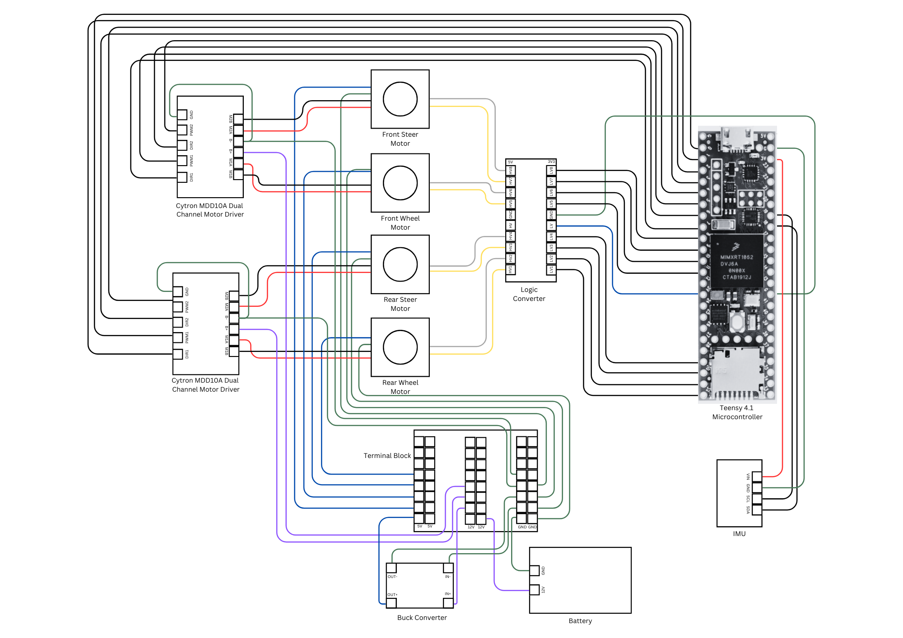

# BiSteerCycle

## Background
People have ridden two-wheeled vehicles since at least the early 1800's, when Karl von Drais created the predecessor to modern-day bicycles. Since then, a variety of two-wheeled single-track and dicycle vehicles have been developed, including the modern bicycle, scooters, motorcycles, and the Segway. Despite the diversity in application and design of these vehicles, however, these vehicles all share a common feature: the steering angles for at least one of the two wheels on each vehicle are fixed. The effect of this design feature is that the movement of two-wheeled vehicles is subject to a non-holonomic constraint, and consequently these vehicles are incapable of translating in directions orthogonal to the directions in which their wheels with fixed steering angles point.

To overcome this limitation in two-wheeled vehicle design, the aim of this project was to design and to create a two-wheeled autonomous robot, hereafter referred to as the “Bi-Steer Cycle”, which has power applied independently to each wheel and which also possesses continuous rotation about each wheel’s steering axle. Creating such a machine not only produces utility from a pedagogical viewpoint, but also may lend to the development of new forms of transportation in the future.

**Credits:** Chris Li, Final Report 2021.

## Motor Controller Design and Derivation

Here are some papers that can be reffered to for the derivation of the motor controllers:
- Dynamic model derivation and controller design for an autonomous bicycle, Shihao Wang, 2014: http://ruina.org/Courses/AutonomousBicycleTeam/ShihaoWang.pdf
- Small Wheel Bicycle Model Derivation, Zhidi Yang, 2018: http://ruina.org/Courses/AutonomousBicycleTeam/Zhidi%20Yang%20-%20Small_Wheel_Bicycle_Model_Derivation_and_Balancing_Controller_Design%20-%208.3[12156].pdf
- Nonlinear Control of a Double-Steering Robotic Bicycle: From Bicycle to Segway and In-Between, Anshuman Das, 2019: https://drive.google.com/file/d/12ZRajRatO-e00aLpMvUlQFlpHTXgZLRS/view

## Hardware Components

- Teensy 4.1 Microcontroller
- Rhino 100RPM 25Kgcm 12V DC Planetary Geared Quad Encoder Servo Motor (RMCS-5031)
- Rhino 500RPM 6KGCM 12V DC Planetary Geared Quad Encoder Servo Motor (RMCS-5034)
- Cytron MDD10A Motor Driver
- BNO-055 Inertial Measurement Unit
- LM2596S DC Buck Converter
- Songle Single-channel 5V 30A Relay Module

## Assembly

Fig: Front Wheel Assembly

Fig: BiSteer Assembly

**Credits:** Nilay Srivastava, BiSteer Cycle 2023

## Pin Diagram

**Credits:** Jia Bhargava, Tanay Srinivasa